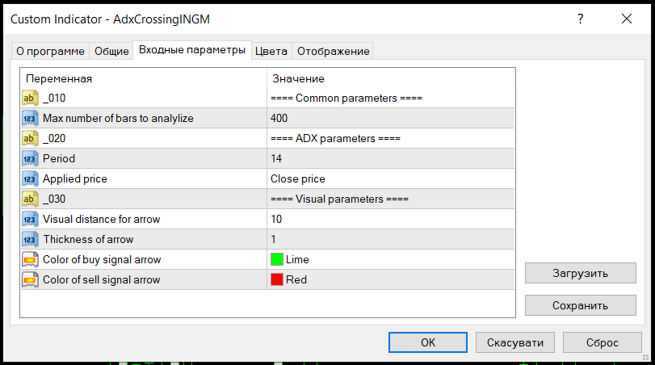
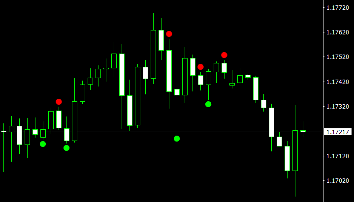

# Forex ADX Crossing Indicator for MT4
Indicator shows possible BUY/SELL entry points by ADX cossing.

## Installation
- Copy [AdxCrossingINGM.mq4](AdxCrossingINGM.mq4) file to `<METATRADER_DATA_DIR>\MQL4\Indicators` folder.
- Update list of indicators on Navigator panel.
- Drag `AdxCrossingINGM` indicator on a graph.

## Configuration
Available settings of indicator:

## Usage
Make a decision for BUY/SELL order using signals of indicator:

## History
This indicator is based on [Adx crossing.mq4](releases/1.0/Adx&#32;crossing.mq4) initially developed by Amir.
I've just refactored it for my needs, added new features, etc.

## Contribution
Feel free to create issue or pull request if any ideas.
